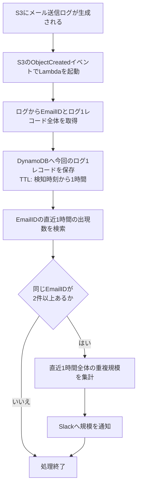

# ⚠️ 本書は廃止：OAメール多重送信検知：送信側重複（8月型）

> **この版は採用しない。現行の設計仕様は
> [OAメール多重送信検知_送信側重複_最小修正版.md](OAメール多重送信検知_送信側重複_最小修正版.md) を参照すること。**
>
> 本書は `recordId` 主キー、GSI 2本（`email-detected-at-index` / `window-bucket-detected-at-index`）、
> 直近1時間全体の集計通知を前提としているが、いずれも実装されていない。
> GSI は仕様上 `ConsistentRead` を指定できず常に結果整合性であるため、
> 書き込み直後のレコードが検索に載らず重複を取りこぼすことがレビューで判明し、
> パーティションキーを `EmailID` とする構成へ変更した。
> 経緯の記録としてのみ残している。

> 修正版。DynamoDB のログ1レコード保存モデルと、Slack の規模通知を反映する。

## 目的

S3 に保存されたメール送信ログを契機に、同じ `EmailID` が直近1時間以内に複数回出力されていないかを検知する。重複を検知した場合は Slack へ重複の規模を通知する。

この仕組みはメール送信を止めるものではなく、メール送信ログ上の重複を検知して運用者へ知らせるためのものである。

## 検知対象

本方式で検知するのは、**送信側重複（8月型）**のみである。

同じ `EmailID` のメール送信成功ログが、1時間以内に2回以上出力された場合に重複として検知する。これは、同じ `emails` テーブルの行が複数回送信されたケースを想定している。

| ケース | 本方式での検知 |
| --- | --- |
| 同じ `EmailID` の送信成功ログが複数回出る（送信側重複／8月型） | 検知する |
| 異なる `EmailID` で同じ内容のメールが複数生成される（生成側重複） | 検知しない |
| 異なる `EmailID` で同じ通知がメール化される（通知多重メール化） | 検知しない |
| メール送信失敗ログ | 検知しない |

Slack 通知は、同一 `EmailID` の存在そのものを列挙せず、直近1時間の重複規模を示す。

## 対象としないこと

初期実装では、以下は考慮しない。

- Fluent Bit 再起動によるログ再送
- S3 イベントの重複配信
- Lambda 再試行による同じログの再処理

したがって、S3 に新しいメール送信ログが生成されるたびに、1回だけ Lambda が起動する前提とする。

## 構成

```text
S3（メール送信ログ）
  └─ ObjectCreated イベント
       └─ Lambda（重複検知）
            ├─ DynamoDB へログ1レコード全体を保存
            ├─ EmailID の直近1時間の出現数を検索
            └─ 重複時に Slack へ直近1時間全体の規模を通知
```

## 入力ログ

Lambda はメール送信成功ログから `EmailID` を取得する。対象コマンドは `EvenSendEmails`、`OddSendEmails`、`SendEmails` とする。

```text
[2026-09-07 12:34:56] production.INFO: EvenSendEmails [production] success  sending email: 123 {...}
```

`success` を含み、`sending email:` の後ろに数値の `EmailID` がある行だけを対象にする。`failed sending email:` などの失敗ログは保存・判定の対象外とする。

平文ログ、Fluent Bit JSON Lines、gzip 圧縮された `.gz` のいずれも入力できる。

## 処理フロー



## DynamoDB

### 保存する項目

`mail_send_log_events` テーブルには、対象ログの1レコードごとに以下を保存する。

| 項目 | 内容 |
| --- | --- |
| `recordId` | S3 バケット、キー、行番号から生成するログレコードID |
| `EmailID` | 重複判定の対象となるメールID |
| `detectedAt` | Lambda が検知・保存した時刻 |
| `logTimestamp` | Fluent Bit JSON に含まれる元ログ時刻。存在する場合のみ保存 |
| `command` | `EvenSendEmails` などの送信コマンド |
| `sourceBucket` / `sourceKey` / `sourceLineNumber` | 入力元の S3 オブジェクトと行番号 |
| `rawLog` | 入力された元のログ1行 |
| `logMessage` | JSON Lines から取り出した Laravel ログメッセージ |
| `windowBucket` | 直近1時間全体の集計に使う UTC 時間バケット |
| `expiresAt` | `detectedAt` から1時間後の Unix 時刻。DynamoDB TTL に使用 |

S3 は原本ログの保管先であり、DynamoDB は直近1時間の検知・集計用にログレコード全体を保持する。`expiresAt` を DynamoDB TTL 属性として有効化し、検知時刻から1時間後に削除対象とする。TTL の削除処理は非同期であり、期限時刻ちょうどの削除は保証されないため、検索時にも直近1時間の時刻条件を付ける。

### キーとインデックス

```text
主キー
  PK: recordId

GSI: email-detected-at-index
  PK: EmailID
  SK: detectedAt

GSI: window-bucket-detected-at-index
  PK: windowBucket
  SK: detectedAt

TTL 属性: expiresAt
```

主キーを `EmailID` にしないため、DynamoDB は EmailID をキーとした KVS ではなく、ログ1レコードを保存するデータストアとなる。

`email-detected-at-index` は、同一 `EmailID` の直近1時間の件数を調べるために使う。`window-bucket-detected-at-index` は、直近1時間全体の重複規模を集計するために、現在時刻の時間バケットと1つ前の時間バケットを検索する。

GSI の読み取りは結果整合性である。Lambda は保存直後の自身のレコードを集計へ明示的に加えるが、S3 の重複配信や Lambda 再試行を厳密に排除する要件が発生した場合は、別途冪等化・集計専用テーブルを追加する。

## Slack 通知

現在の Lambda 実行で重複が発生した場合、Slack には直近1時間全体で集計した規模を通知する。個別の `EmailID` やログ本文は通知しない。

```text
⚠️ メール送信重複を検知しました
対象期間(UTC): 2026-09-14T01:00:00+00:00 - 2026-09-14T02:00:00+00:00
重複対象 EmailID 数: 12
2件目以降の重複ログ件数: 27
検知日時(UTC): 2026-09-14T02:00:00+00:00
```

| 項目 | 内容 |
| --- | --- |
| 重複対象 EmailID 数 | 直近1時間に2件以上出現した EmailID のユニーク数 |
| 2件目以降の重複ログ件数 | 各 EmailID の出現数から初回1件を除いた合計 |

この形式により、大量発生時にも Slack の文字数制限を避けつつ、運用者が影響規模を把握できる。

## 検知性能と制約

- 判定窓は、Lambda が今回のログを検知・保存した時点から遡る**直近1時間**である。
- 同一 `EmailID` がこの範囲に2件以上あれば重複と判定する。
- 1件目は通知しない。
- 1回の Lambda 実行中に複数の重複を検知しても、Slack 通知は1回にまとめる。
- 通知までの時間は、メール送信、ログ出力、S3 保存、Lambda 実行、DynamoDB 検索、Slack 通信の合計となる。

本方式は即時の送信抑止ではなく、S3 にログが生成された後の検知・通知に用いる。実際の通知時間は Fluent Bit などによる S3 保存間隔にも依存する。

## 判定例

| 時刻 | EmailID | 判定 |
| --- | --- | --- |
| 10:00 | `mail-001` | 初回。通知しない |
| 10:20 | `mail-001` | 1時間以内に2件目。重複規模を Slack 通知する |
| 10:30 | `mail-002` | 初回。`mail-001` の重複規模は直近1時間集計に含まれる |
| 11:05 | `mail-001` | 10:00 の記録は対象外。10:20 以降の件数で判定する |
