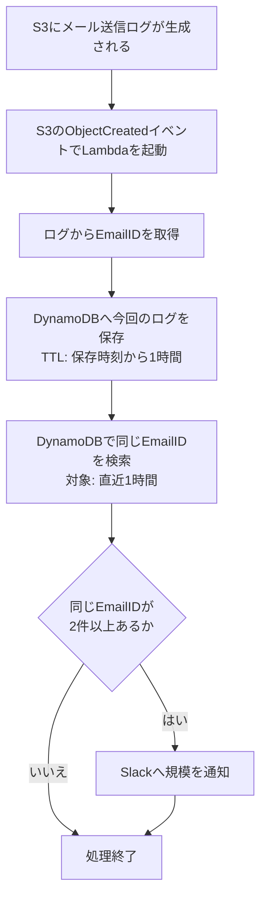

# OAメール多重送信検知：送信側重複（8月型）

> **本書が現行の設計仕様である。**

## 目的

S3に保存されたメール送信ログを契機に、同じ`EmailID`が直近1時間以内に複数回出力されていないかを検知する。重複を検知した場合はSlackへ重複の規模を通知する。

この仕組みはメールの送信を止めるものではなく、メール送信ログ上の重複を検知して運用者へ知らせるためのものである。

## 検知対象

本方式で検知するのは、**送信側重複（8月型）**のみである。

同じ`EmailID`のメール送信成功ログが、1時間以内に2回以上出力された場合に重複として検知する。これは、同じ`emails`テーブルの行が複数回送信されたケースを想定している。

| ケース | 本方式での検知 |
|---|---|
| 同じ`EmailID`の送信成功ログが複数回出る（送信側重複／8月型） | 検知する |
| 異なる`EmailID`で同じ内容のメールが複数生成される（生成側重複） | 検知しない |
| 異なる`EmailID`で同じ通知がメール化される（通知多重メール化） | 検知しない |
| メール送信失敗ログ | 検知しない |

このため、Slack通知は「同じEmailIDの送信成功ログが複数回あった」ことを示すものであり、異なるEmailID間の内容重複までは判定しない。

なお表中の「検知する」は、**送信成功ログが複数回出力された場合**を指す。送信は行われたがログ出力に至らなかった経路は検知できない（「制約」を参照）。

## 前提環境

本書の設計判断は、以下の実環境を前提としている。

| 項目 | 内容 |
|---|---|
| アプリサーバー台数 | 通常2台、最大3台（オートスケールにより可変） |
| 送信スループット | 1台あたり毎分約80通、3台で毎分約240通 |
| ログ配送 | ホストごとに Fluent Bit が独立して S3 へ出力する |
| S3への保存間隔 | 現行10分 |

**ホストごとに Fluent Bit が動いているため、同じ時刻に送られたメールのログであっても、ホストが違えば別のS3オブジェクトになる。** 各オブジェクトの生成がそれぞれLambdaを起動するので、**Lambdaは日常的に複数同時に実行される**。

これが重要なのは、検知したい事象そのものが複数ホストにまたがるためである。二重起動によって同じ`emails`の行が別ホストから送信された場合、その2件のログは別オブジェクトに分かれ、別々のLambdaがほぼ同時に処理する。互いのレコードが見えなければ、どちらも「1件目」と判断して重複を見逃す。「重複の判定」で強整合読み取りを必須としているのは、この経路を塞ぐためである。

## 対象としないこと

初期実装では、以下は考慮しない。

- Fluent Bit再起動によるログ再送
- S3イベントの重複配信

一方、**Lambda再試行による同じログの再処理は、再試行そのものを無効化することを前提とする**。Lambdaのイベント呼び出し設定で `maximum-retry-attempts` を `0` にすること。

S3からの呼び出しは非同期であり、既定では未処理の例外に対して最大2回再試行される。再試行では同じS3オブジェクトが再処理されるが、`recordKey`の先頭に含まれる`createdAt`は実行ごとに変わるため、同じログ行が別レコードとして保存され、実際には発生していない重複が検知される。

したがって、S3に新しいメール送信ログが生成されるたびに、同一オブジェクトについては1回だけLambdaが起動する前提とする。

## 構成

```text
ホスト1 ─ Fluent Bit ─┐
ホスト2 ─ Fluent Bit ─┼→ S3（メール送信ログ／ホストごとに別オブジェクト）
ホスト3 ─ Fluent Bit ─┘      └─ ObjectCreatedイベント（オブジェクトごとに1回）
                                  └─ Lambda（重複検知／同時に複数実行されうる）
                                       ├─ ログ1行ごとにDynamoDBへ保存
                                       ├─ 同じEmailIDの直近1時間の件数を検索
                                       └─ 重複時にSlackへ通知
```

## 入力ログ

Lambdaはメール送信成功ログから`EmailID`を取得する。対象コマンドは`EvenSendEmails`、`OddSendEmails`、`SendEmails`とする。

ログ形式の例は以下のとおりである。

```text
[2026-09-07 12:34:56] production.INFO: EvenSendEmails [production] success  sending email: 123 {...}
```

`success`を含み、`sending email:`の後ろに`EmailID`がある行だけを対象にする。`EmailID`は`emails`テーブルの主キーであり、**数字のみで構成される**。`failed sending email:`などの失敗ログは保存・判定の対象外とする。

## 処理フロー



## DynamoDB

### 保存する項目

ログに`EmailID`が1回出るごとに、DynamoDBへ1レコードを保存する。判定に必要な項目に加え、事後調査のためログ行そのものと入力元を保持する。

| 項目 | 内容 |
|---|---|
| `EmailID` | 保存・重複判定の対象となるメールID |
| `recordKey` | 同じ`EmailID`の出現を別レコードとして保存するためのソートキー（後述） |
| `createdAt` | 直近1時間に絞り込むための検知時刻 |
| `logTimestamp` | 元ログに記録された送信時刻。保存のみで、判定には使用しない |
| `command` | `EvenSendEmails`などの送信コマンド |
| `sourceBucket` / `sourceKey` / `sourceLineNumber` | 入力元のS3オブジェクトと行番号 |
| `sourceHost` | ログを出力したインスタンス。Fluent Bit が付与する `instance_id`。S3キーにホスト識別子が含まれないため、重複が別インスタンス由来か同一インスタンス由来かの切り分けにはこの属性が必要 |
| `rawLog` | 入力された元のログ1行 |
| `expiresAt` | `createdAt`から1時間後のUnix時刻。DynamoDB TTLに使用する |

### キー構成

```text
PK: EmailID
SK: recordKey = {createdAt}#{sourceKey}#{sourceLineNumber}
TTL属性: expiresAt
```

`EmailID`だけをキーにすると、同じIDの2件目を保存した際に1件目が上書きされ、重複回数を判定できない。そのため、`EmailID`をPK、`recordKey`をSKとして、同じIDの出現を別レコードとして残す。

```text
EmailID = 123
  ├─ recordKey = 2026-09-11T01:00:00.123456+00:00#.../a1b2.gz#41
  └─ recordKey = 2026-09-11T01:20:00.987654+00:00#.../c3d4.gz#87
```

SKには`createdAt`だけでなく`sourceKey`と`sourceLineNumber`を含める。`createdAt`のみをSKにすると、**同一のS3オブジェクト内にある複数行が同じLambda実行で処理されて同一時刻となり、PK+SKが衝突して2件目が1件目を上書きし、検知できなくなる**。S3キーはオブジェクトごとに一意、行番号はファイル内で一意であるため、この組でログ1行につき必ず別レコードとなる。

`createdAt`をSKの先頭に置くことで文字列の辞書順が時系列順と一致し、時刻範囲での絞り込みがそのまま機能する。`createdAt`は管理対象そのものではなく、同じ`EmailID`の出現を別レコードとして保存し、1時間以内に絞り込むための補助情報である。

辞書順と時系列順が一致するには、次の2点を満たす必要がある。どちらかが崩れると時刻範囲の絞り込みが正しく動かなくなる。

- **タイムゾーンを全レコードで統一する。** 本方式ではUTC固定とする。`+09:00`と`+00:00`が混在すると、文字列比較では前者が後者より大きいと判定され、順序が壊れる。
- **桁数を固定する。** マイクロ秒まで常に6桁で出力する。Pythonの`datetime.isoformat()`は既定（`timespec="auto"`）ではマイクロ秒が0のときに小数部ごと落ちて幅が変わるため、`timespec="microseconds"`を明示する。

### 重複の判定

Lambdaは今回のレコードを保存した後、`EmailID`を指定して検索する。`recordKey`は文字列であるため、検索条件は「現在時刻の1時間前」を`createdAt`と同じ書式で文字列化したものとの比較となり、`recordKey >= "2026-09-11T00:20:00.000000+00:00#"`のような形になる。これに一致するレコードが2件以上あれば重複と判定する。ここで使う時刻はメール本文やログ行に記録された送信時刻ではなく、**Lambdaがログを検知してDynamoDBへ保存した時刻**に統一する。

保存直後のレコードを確実に検索結果へ含めるため、DynamoDBの`Query`では強い整合性を有効にする（`ConsistentRead=true`）。`EmailID`をPKとしているためベーステーブルを直接検索でき、強整合読み取りを指定できる。

`EmailID`をパーティションキーから外し、GSI経由で検索する構成は採用しない。**GSIは仕様上`ConsistentRead`を指定できず、常に結果整合性となる**ため、書き込みから反映までの間に行われた検索にはそのレコードが載らない。「前提環境」のとおり別ホスト由来のログは別のLambdaが同時に処理するため、互いのレコードが見えず重複を取りこぼす。

`Query`は1回の呼び出しで最大1MB分しか評価せず、超過分はエラーではなく`LastEvaluatedKey`として持ち越される。単一の`EmailID`にレコードが集中した場合に件数が過少になるため、`LastEvaluatedKey`が返る間はページングして件数を合算する。

この`Query`が返す件数は、そのまま「その`EmailID`が直近1時間に何件出たか」を表す。Slack通知に載せる件数はこの値を再利用し、集計のための追加の検索は行わない。

> DynamoDB TTLは期限時刻ちょうどに削除されるものではない。そのため、検索時にも直近1時間の時刻条件を付ける。これにより、TTL削除が遅れた古いレコードを重複として扱わない。

## Slack通知

重複時には、個別の`EmailID`を全件列挙しない。1000件規模の重複が発生した場合にSlackの文字数制限（メッセージブロック約3000文字）へ当たるためである。代わりに、規模を示す2つの数値と、直近1時間の出現件数が最も多い`EmailID`を1件だけ通知し、後者を調査の起点とする。

```text
⚠️ メール重複を検知しました
検知した重複: 3 件
最多の EmailID: 8 件（EmailID: 123）
検知日時: 2026-09-11 10:20:00 JST
```

| 項目 | 内容 |
|---|---|
| 検知した重複 | このLambda実行で重複と判定した`EmailID`の数 |
| 最多の EmailID | 重複と判定した`EmailID`のうち、直近1時間の出現件数が最も多いものの件数と`EmailID` |

「最多の EmailID」の件数には、判定に用いた`Query`の件数をそのまま使う。この値は直近1時間のローリング件数であるため、`8 件`は「1通のメールが直近1時間で8回送信されている」ことを意味する。重複が継続していれば後続のLambda実行でこの値が増えるため、規模の推移も追える。

通知本文の長さは重複件数によらず一定であり、大量発生時にも文字数制限に当たらない。

## 検知性能と制約

### 判定性能

- 判定窓は、Lambdaが今回のログを検知・保存した時点から遡る**直近1時間**である。
- 同一`EmailID`がこの範囲に2件以上あれば検知する。
- 1件目は通知しない。
- 1回のLambda処理につき、Slackへの通知は1回にまとめる。同じS3オブジェクト内に同じ`EmailID`が3件以上含まれていても通知は1回とし、通知本文には検知した重複件数と、`EmailID`あたりの最多件数を記載する。

### 通知までの時間

検知はS3にログが保存された後に始まる。そのため、通知までの時間は次の合計となる。

```text
メール送信
  → ログ出力
  → Fluent Bit が S3 へ保存          ← 保存間隔に支配される（現行10分）
  → S3 イベント通知の配信
  → Lambda 起動
       ├─ ログ1行ごとに: DynamoDB へ保存 → 直近1時間の件数を検索
       └─ 重複があれば Slack へ通知
```

Lambda内部の処理時間は対象ログの行数に比例する（ローカル計測で1行あたり約4.2ms）。ただし通知までの時間全体は、Fluent BitなどによるS3へのログ保存間隔に支配される。

本方式は即時の送信抑止ではなく、S3にログが生成された後の検知・通知に用いる。

### 制約

本方式はメール送信ログを根拠に判定するため、**送信は行われたがログ出力に至らなかった場合は検知できない**。たとえば `send_status` の更新（`$email->save()`）が DB のデッドロックやロック待ちタイムアウトで失敗すると、メールは送信済みでありながら送信成功ログが出力されず、次回実行で同じ行が再送される。この経路ではログ上に1行しか現れないため、同一 `EmailID` の重複として観測されない。これは仕様上の検知対象（送信側重複）に含まれるが、本方式の観測手段では捉えられない。

本書の初期構成は、ログ生成イベントが1回だけ処理される前提である。Fluent Bit再起動によるログ再送とS3イベントの重複配信は現時点では判定対象外とする。Lambda再試行については「対象としないこと」のとおり、設定により無効化することを前提とする。

このうち**S3イベントの重複配信は、発生頻度は低いが影響範囲が大きい**点に留意する。`recordKey` の先頭に含まれる `createdAt` はLambda実行ごとに変わるため、同一オブジェクトが再配信されると同じログ行が別レコードとして保存される。800行を含むオブジェクトが二重配信された場合、その800件すべてが重複と判定され、実際には発生していない大規模な重複として通知される。対応する場合は、ソートキーから `createdAt` を外して `{sourceKey}#{sourceLineNumber}` とし（再処理しても同一キーとなり上書きされる）、直近1時間の絞り込みをソートキーの範囲条件から `createdAt` 属性での比較へ移す。

Lambdaの同時実行については、`EmailID`をPKとするベーステーブルへの強整合読み取りにより、同時に起動した複数のLambdaのいずれかが必ず重複を検知する。ただし双方が検知して通知が2回飛ぶ場合があり（ローカル計測では5回中1回）、通知の重複排除は現時点では行わない。

Slack通知に載せる2つの数値は、いずれもそのLambda実行で検知した重複を対象とする。「最多の EmailID」の件数のみ直近1時間のローリング値であり、検知件数は実行単位である。実行をまたいだ直近1時間全体の重複総数は集計しない。

## 判定例

| 時刻 | EmailID | 判定 |
|---|---|---|
| 10:00 | `123` | 初回。通知しない |
| 10:20 | `123` | 1時間以内に2件目。Slack通知する |
| 11:05 | `123` | 10:00の記録は判定窓の外。10:20の記録との2件で判定し、Slack通知する |
